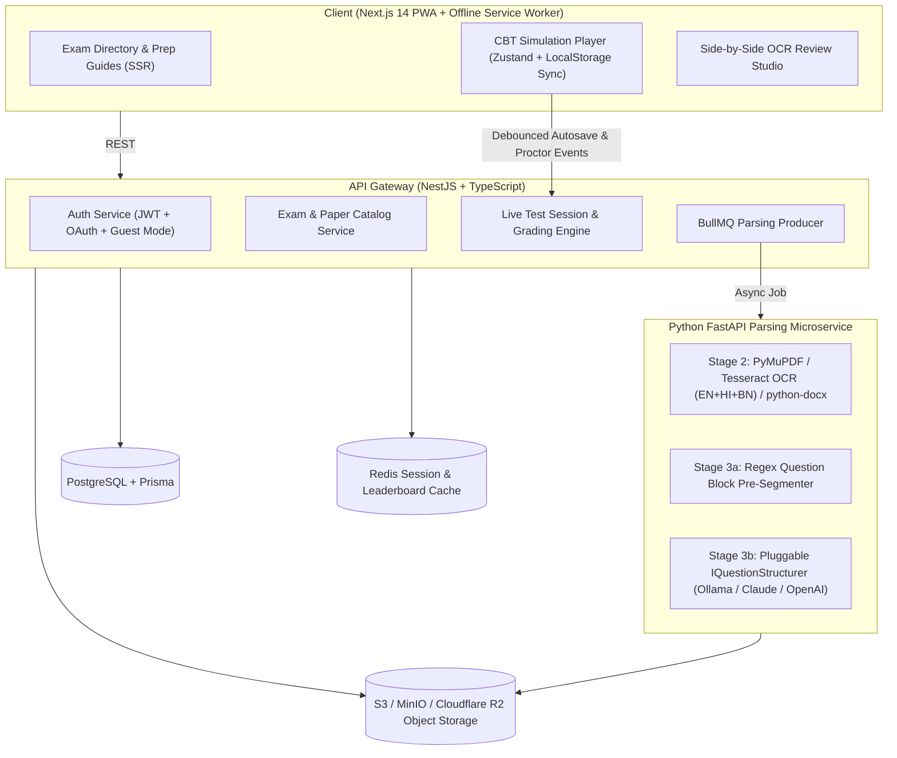

# SarkariPrep Architecture Overview

```mermaid
flowchart TB
    subgraph Client["Client (Next.js 14 PWA + Offline Service Worker)"]
        UI["Exam Directory & Prep Guides (SSR)"]
        CBT["CBT Simulation Player (Zustand + LocalStorage Sync)"]
        ReviewUI["Side-by-Side OCR Review Studio"]
    end

    subgraph Backend["API Gateway (NestJS + TypeScript)"]
        Auth["Auth Service (JWT + OAuth + Guest Mode)"]
        ExamSvc["Exam & Paper Catalog Service"]
        SessionSvc["Live Test Session & Grading Engine"]
        QueueProd["BullMQ Parsing Producer"]
    end

    subgraph Worker["Python FastAPI Parsing Microservice"]
        Extract["Stage 2: PyMuPDF / Tesseract OCR (EN+HI+BN) / python-docx"]
        Segment["Stage 3a: Regex Question Block Pre-Segmenter"]
        LLMStruct["Stage 3b: Pluggable IQuestionStructurer (Ollama / Claude / OpenAI)"]
    end

    DB[(PostgreSQL + Prisma)]
    Cache[(Redis Session & Leaderboard Cache)]
    S3[(S3 / MinIO / Cloudflare R2 Object Storage)]

    Client -->|REST| Backend
    CBT -->|Debounced Autosave & Proctor Events| SessionSvc
    Backend --> DB
    Backend --> Cache
    Backend --> S3
    QueueProd -->|Async Job| Worker
    Worker --> S3
```
